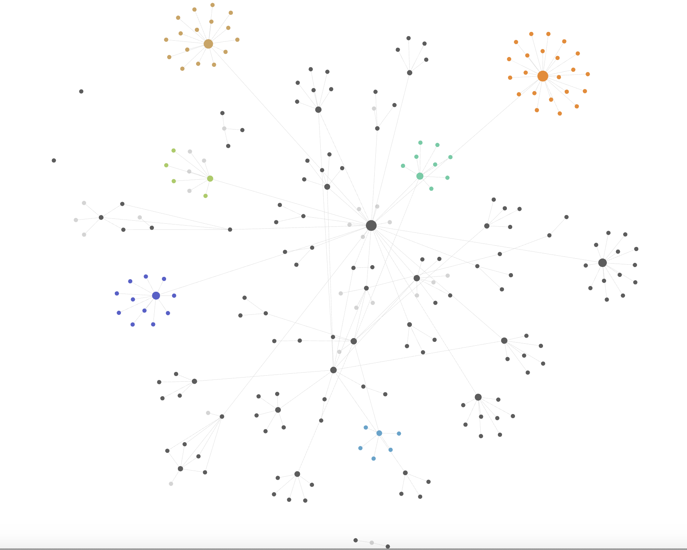
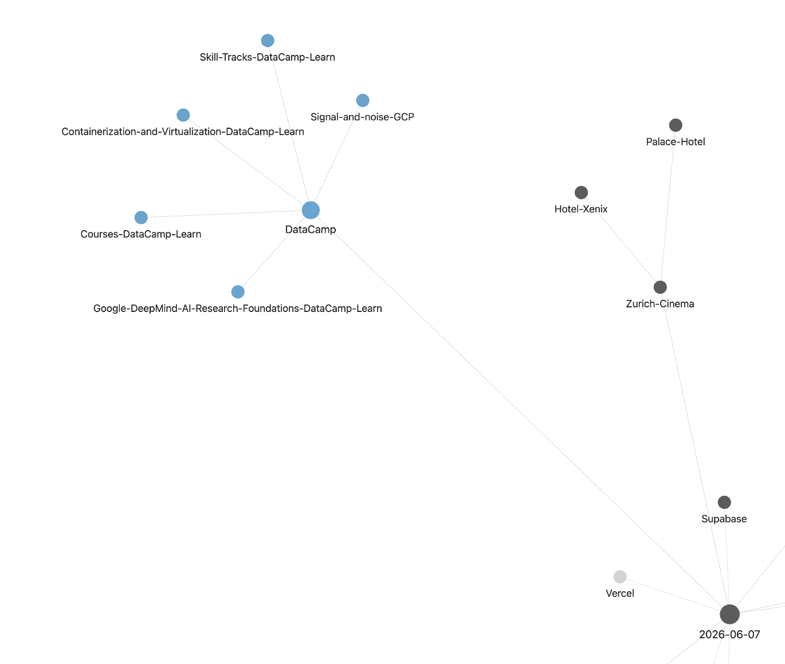
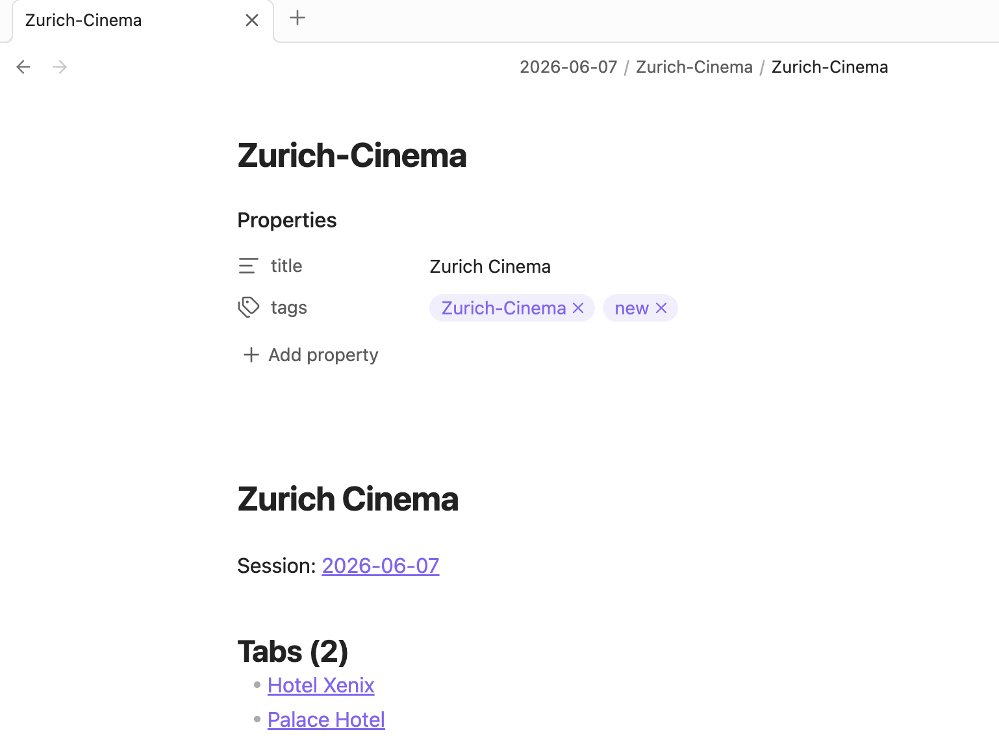
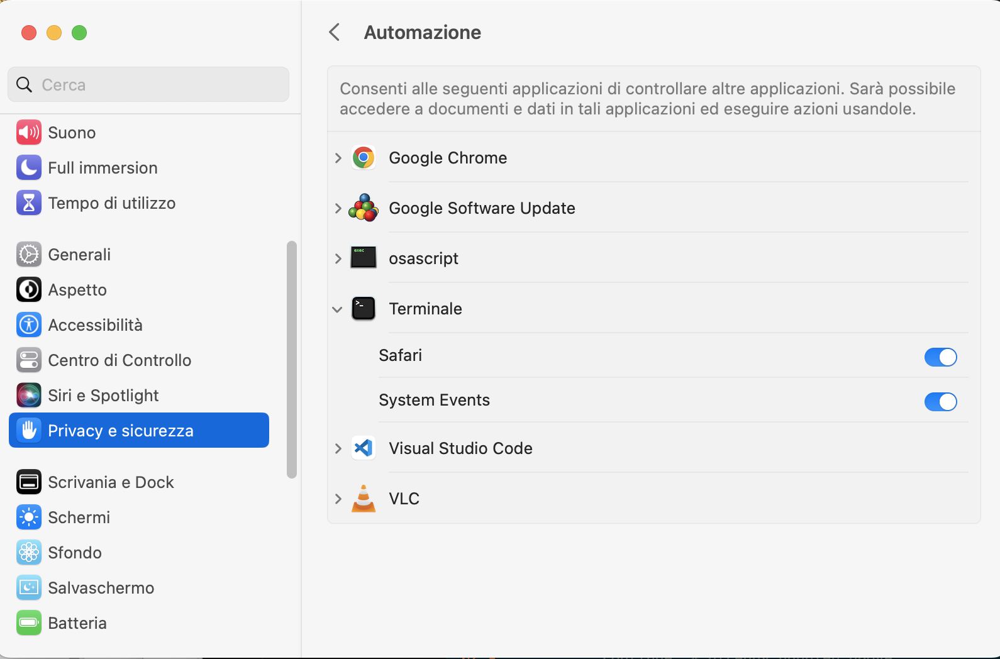

# safari-tabs

> One command captures every open Safari tab, groups them by topic with Claude AI, and saves them as searchable Obsidian notes — so your tab hoarding finally has a home.

## What it does

- Reads every open tab from Safari via AppleScript — titles, URLs, all windows
- Sends them to Claude, which invents tag names from the actual content (no preset categories)
- Writes each tab as a note in `~/Documents/safari-tabs-vault/`, organized by date and tag
- Preserves "stable" tags across sessions — drag a folder into `Stable/` and new tabs for that topic get appended, not buried
- Redacts sensitive data from URLs before anything leaves your machine
- Never overwrites a previous session: a second run on the same day creates a timestamped folder

## See it in action

Each run builds a graph in Obsidian — colored clusters are topic tags, larger nodes are tag indexes, smaller dots are individual tabs:



<p align="center">
  
  
</p>

## Getting started

**Prerequisites:** macOS, Python 3.11+, Poetry, Safari open with tabs, an Anthropic API key

```bash
# Install
poetry install

# Configure
cp .env.example .env
# edit .env — set ANTHROPIC_API_KEY

# Run
poetry run safari-tabs
```

> **(!) macOS Automation permission** — the first time you run this, macOS may block AppleScript access to Safari. If you see an "unauthorized" error, go to **System Settings → Privacy & Security → Automation** and enable **Safari** under your terminal app.
>
> 

**Common issues:**
- `Safari is not running`: open Safari with at least one tab before running
- `Invalid API key`: check that `ANTHROPIC_API_KEY` is set in `.env` or your shell environment

## How it's built

Four focused modules: `extractor.py` uses `osascript` to pull tab titles and URLs from all Safari windows; `sanitizer.py` scrubs sensitive patterns from URLs; `categorizer.py` makes a single Claude API call with a prompt-cached system prompt, returning a JSON tag map; `vault_writer.py` turns that map into Obsidian markdown notes. The Stable folder mechanism is intentionally simple — presence in `Stable/` is the only signal, no frontmatter editing required.

| Layer | Tech |
|-------|------|
| Tab extraction | AppleScript via `osascript` |
| AI categorization | Claude Sonnet (Anthropic SDK) |
| Note format | Obsidian-flavored Markdown |
| Dependency management | Poetry |
| Runtime | Python 3.11+, macOS only |

## Vault structure

```
safari-tabs-vault/
├── 📄 Safari Tabs.md
├── 📁 Stable/
│   ├── 📄 Stable.md
│   ├── 📁 Claude-AI/              ← validated tag (#stable)
│   │   ├── 📄 Claude-AI.md
│   │   ├── 📄 anthropic-docs.md
│   │   └── 📄 claude-mcp-guide.md
│   └── 📁 Python/                 ← validated tag (#stable)
│       ├── 📄 Python.md
│       └── 📄 pep-695-generics.md
└── 📁 2026-06-13/
    ├── 📄 2026-06-13.md
    ├── 📁 ML-Papers/              ← new tag (#new)
    │   ├── 📄 ML-Papers.md
    │   └── 📄 attention-is-all-you-need.md
    └── 📁 Travel-Italy/           ← new tag (#new)
        ├── 📄 Travel-Italy.md
        └── 📄 rome-airbnb-search.md
```

## Graph coloring in Obsidian

Tag index notes carry `#stable` or `#new` in their frontmatter. To color them in graph view:

1. Open **Settings → Graph view → Groups**
2. Add a group with query `tag:#stable` and assign a color
3. Add a group with query `tag:#new` and assign a different color

## Background

Built out of a familiar problem: being the kind of person who finds something interesting on the internet every five minutes and opens a tab to "read it later," until the browser has 80 tabs and the laptop fan is screaming. This tool turns that habit into an archive — one command and the chaos becomes organized, dated, searchable notes in Obsidian. A security review and test suite are next before the repo goes public.
